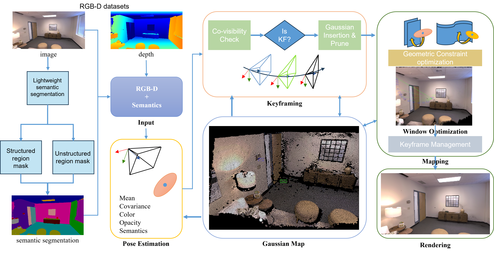

# FVO-GS-SLAM: FFT Edge VO Guided RGBD 2D Gaussian Splatting SLAM

FVO-GS-SLAM is an RGBD SLAM system based on 2D Gaussian Splatting and differentiable surfel rendering. The system uses dense FFT Edge VO (EAGS-SLAM style DT alignment + LM optimization) for tracking initialization, render-based pose refinement, RGB/depth/normal joint Gaussian-only mapping, motion-based submap management, CosPlace retrieval + Reloc3R keyframe pair estimation + RGB-D depth verification + keyframe-level PGO, and streaming global Gaussian fusion.

The maintained direction is RGBD indoor SLAM on TUM RGBD, Replica, and ScanNet++ datasets.

<p align="center">
  <a href="">
    
  </a>
</p>

---

## Statement

This repository is developed from the MonoGS style Gaussian SLAM framework and has been extended into an RGBD 2D Gaussian SLAM system with FFT Edge VO guided tracking initialization, motion-based submap management, and submap-level global consistency handling.

The current system includes:

- RGBD dataset loading (TUM, Replica, ScanNet++, Realsense live)
- FFT high-frequency mask generation (CLAHE → FFT → Gaussian HPF → IFFT → threshold)
- FFT Edge VO: dense DT alignment + damped Gauss-Newton (EAGS-SLAM / Edge VO style)
- Render-based pose refinement (RGB + depth tracking loss)
- Keyframe selection and sliding window management
- Asynchronous back end Gaussian-only mapping (RGB + depth + normal)
- 2D Gaussian map representation with differentiable surfel rendering
- Finite difference normal (FDN) supervision
- Gaussian densification, opacity reset, and pruning
- Visibility maintenance with `occ_aware_visibility`
- Motion-based submap cutting (translation/rotation threshold relative to submap anchor)
- Independent submap initialization from seed frames
- Submap checkpoint saving (Gaussian params, keyframe poses, seed global C2W, relative/correct tsfm)
- RSKM (Random Sampling Keyframe Mapping): random keyframe replay within active submap
- Cross-submap covisibility handoff: frozen boundary Gaussians smooth submap transitions
- Active-only coverage for correct hole detection after submap cut
- CosPlace visual descriptor extraction from saved keyframe images
- Keyframe-level loop candidate retrieval (cross-submap pair selection)
- Reloc3R (DUSt3R variant) keyframe pair coarse relative pose estimation
- RGB-D depth geometric verification with log-spaced scale search
- Keyframe-level pose graph construction (temporal/handoff/loop edges)
- Keyframe PGO trial + safety evaluation (Open3D LM, correction/residual gates)
- Per-keyframe trajectory correction + submap-median Gaussian correction
- Streaming submap loading and global Gaussian concatenation
- `rigid_transform_2dgs` for applying correction transforms to 2DGS params
- ATE trajectory evaluation and rendering quality evaluation
- Optional GUI visualization
- Ablation switches for controlled experiments
- GPU memory monitoring (peak minus baseline)

---

## Main Differences from MonoGS

### 1. RGBD oriented 2D Gaussian SLAM pipeline

The system uses RGBD observations to initialize, track, and optimize a 2D Gaussian map. The renderer outputs RGB, depth, opacity, visibility, radii, normal, and `n_touched`. These outputs feed tracking loss, mapping loss, visibility update, densification, pruning, evaluation, and global fusion.

### 2. FFT Edge VO for tracking initialization

The project adds a dense FFT Edge VO module (`utils/fft_edge_vo.py`), aligned with EAGS-SLAM's Edge VO design:

- **cur→ref direction**: current-frame 3D points projected into reference-frame distance-transform pyramid.
- Reference DT + Sobel gradients are built once in `set_reference()` and reused for subsequent frames.
- Per-frame optimization: damped Gauss-Newton (LM-style) with analytic SE(3) Jacobian.
- Coarse-to-fine pyramid optimization with configurable levels and iteration budgets.
- The initial guess (`init_c2w`) is properly seeded into the optimizer via `_se3_log(T_rc_init)`.

FFTEdgeVO provides the tracking initial pose but does not replace differentiable render-based refinement.

### 3. Front end tracking and keyframe management

The front end is the main process, responsible for camera tracking, keyframe insertion, sliding window maintenance, visibility synchronization, submap cut decisions, and communication with the back end.

Tracking flow per frame:
1. FFT mask generation for the current frame
2. FFTEdgeVO.track() → initial pose from dense DT alignment
3. Render-based pose refinement (Adam on `cam_rot_delta` / `cam_trans_delta`)
4. Auto-refresh FFTEdgeVO reference when quality degrades
5. Keyframe decision (overlap ratio + translation threshold)
6. Submap motion monitoring and cut triggering

### 4. Back end Gaussian-only local mapping

The back end is an independent process that initializes and optimizes the 2D Gaussian map from keyframes. By default, `optimize_keyframe_pose` is `true` (EAGS-style: keyframe pose optimization enabled with pose sanity checks). `optimize_keyframe_exposure` is `false`.

Mapping includes:
- RGB L1 + DSSIM loss
- Depth L1 loss
- FDN normal supervision (when enabled)
- FFT frequency mask guided sampling and initial scale
- Error mask guided dynamic point insertion (holes + depth penetration)
- Periodic densify, opacity reset, and prune

### 5. Submap based SLAM

Motion-based submap cutting: a new submap starts when current camera motion relative to the submap anchor exceeds the configured translation or rotation threshold. Each submap is an independent memory and optimization partition.

Submap checkpoint fields:
- `gaussian_params` — `capture_dict()` output
- `submap_keyframes` — sorted keyframe indices
- `seed_global_c2w` — seed frame global C2W
- `submap_keyframe_poses` — all keyframe C2W poses
- `relative_pose` — previous submap seed → current submap seed
- `correct_tsfm` — loop closure / PGO correction (default identity)

On submap cut, the back end prunes ALL Gaussian points and resets optimizer state for the next independent submap.

When `use_handoff: true`, the system preserves a small set of boundary Gaussians from the old submap as short-term frozen tracking support (see [Handoff Mechanism](#7-cross-submap-covisibility-handoff)).

### 6. Loop closure and PGO

The loop closure process runs as an independent process:

1. **Visual retrieval**: Extract CosPlace descriptors (ResNet18 backbone + GeM pooling, weights loaded from disk) from saved keyframe images. Adaptive threshold from self-similarity. **Stage 2**: keyframe-level retrieval produces keyframe pair candidates (not submap pairs).
2. **Reloc3R keyframe pair estimation** (Stage 3): DUSt3R-variant coarse relative pose for each keyframe pair. Raw translation preserved; scale search delegated to depth verification.
3. **RGB-D depth geometric verification** (Stage 4): Back-project source depth, transform with Reloc3R pose, project to target, compare depth. Log-spaced scale search (0.1-20×) to find optimal scale. Filters pairs by overlap, depth RMSE, and inlier ratio.
4. **Refinement → VerifiedLoopEdge** (Stage 5): Delta gates (vs odometry, final depth RMSE). Produces `VerifiedLoopEdge` with `accepted_for_pgo` decision.
5. **Keyframe pose graph construction** (Stage 6): Nodes = keyframe global C2W (not submap seeds). Edges = temporal (adjacent KFs), handoff (cross-submap boundary), loop (verified closures).
6. **Keyframe PGO trial + safety evaluation** (Stage 7): Open3D `GlobalOptimizationLevenbergMarquardt` on keyframe graph. Safety gates: max correction t/r, odom residual increase ratio, loop residual decrease ratio, robust edge pruning (max 2 retries). Trial runs in memory only; does NOT write to ckpt by default.
7. **Trajectory correction** (Stage 8): Accepted PGO → apply per-keyframe corrections (keyframes use optimized_c2w, non-keyframes use nearest-KF correction). Left-multiply: `corrected_c2w = delta @ original_c2w`.
8. **Gaussian correction** (Stage 9): Per-submap median correction from keyframe corrections. Chordal-mean rotation, element-wise median translation.

**LoopClosure mode control** (Stage 0):
- `off`: loop closure process idles
- `detect_only`: CosPlace retrieval only, no Reloc3R/PGO
- `verify_only`: retrieval + Reloc3R + depth verify, NO correct_tsfm write
- `keyframe_pgo`: full pipeline including PGO trial (write only when safety passes)

### 7. Streaming global fusion

After front end finishes, the main process:
1. Stops the back end (saves final submap)
2. Stops loop closure (finalizes PGO)
3. Streams submap checkpoints from disk
4. Applies `correct_tsfm` via `rigid_transform_2dgs`
5. Concatenates all submap Gaussians into a single global model
6. Evaluates ATE and rendering quality
7. Optionally saves final PLY

### 8. Cross-Submap Covisibility Handoff

To mitigate tracking degradation after submap cuts (caused by sudden loss of all old Gaussians), the system supports boundary handoff:

1. **Selection**: At submap cut, the seed frame and old submap tail keyframes are rendered against the old Gaussian map. Boundary Gaussians visible from both the seed frame and tail keyframes are selected by support count and opacity score.
2. **Frozen container**: Selected Gaussians are exported via `capture_masked()` and stored as a frozen `GaussianModel` (no optimizer, no training).
3. **Tracking support**: During warmup, the front end creates a merged render model (`create_merged_for_render`) combining active new Gaussians with frozen handoff Gaussians, providing dense photometric constraints for tracking.
4. **Active-only insertion**: Error masks for new Gaussian insertion use active-only render (`self.gaussians`), preventing handoff from masking coverage holes.
5. **Auto-drop**: Handoff is removed when the new submap reaches `handoff_warmup_keyframes` keyframes, `handoff_warmup_frames` frames, or active opacity coverage exceeds `handoff_new_coverage_th`.
6. **Ckpt isolation**: Handoff Gaussians are never saved to new submap checkpoints and are cleared on handoff deactivation.

Configuration (all under `Submap`):
```yaml
use_handoff: false          # master switch
handoff_tail_kfs: 4         # old submap tail keyframes for covisibility
handoff_max_points: 3000    # max boundary Gaussians to retain
handoff_min_support: 2      # min keyframes that must observe a Gaussian
handoff_opacity_min: 0.20   # min opacity threshold
handoff_warmup_frames: 20   # max frames before forced drop
handoff_warmup_keyframes: 3 # max keyframes before forced drop
handoff_new_coverage_th: 0.85  # active coverage threshold for early drop
```

---

## Repository Structure

```text
FVO-GS-SLAM
├── slam.py                         # main entry, process orchestration, streaming fusion, evaluation
├── run_ablation.py                 # ablation experiment runner
├── run_all_slam.sh                 # batch running script
├── configs/
│   └── rgbd/
│       ├── tum/                    # TUM RGBD: base_config.yaml + scene overrides
│       ├── replica/                # Replica: base_config.yaml + scene overrides
│       └── scannetpp/              # ScanNet++: base_config.yaml + scene overrides
├── gaussian_splatting/
│   ├── gaussian_renderer/          # differentiable 2DGS surfel rendering
│   └── scene/gaussian_model.py     # Gaussian params, densify, prune, optimizer state
├── gui/                            # optional GUI visualization (OpenGL)
├── scripts/                        # dataset download scripts
├── tools/                          # debugging and testing tools
├── tests/                          # unit tests
├── weights/                        # CosPlace model weights
├── utils/
│   ├── slam_frontend.py            # tracking, keyframes, submap decisions, queue comms
│   ├── slam_backend.py             # Gaussian mapping, densify/prune, submap save
│   ├── fft_edge_vo.py              # FFT Edge VO: dense DT alignment + LM optimization
│   ├── fft_filter.py               # FFT high-frequency mask generation
│   ├── loop_closure.py             # CosPlace, keyframe retrieval, Reloc3R/depth/PGO pipeline
│   ├── reloc3r_adapter.py          # Reloc3R keyframe pair coarse pose estimation
│   ├── keyframe_pgo.py             # keyframe graph build, PGO trial, safety eval, corrections
│   ├── loop_depth_verifier.py      # RGB-D depth geometric verification with scale search
│   ├── slam_utils.py               # tracking/mapping loss functions
│   ├── pose_utils.py               # SE(3) pose update utilities
│   ├── camera_utils.py             # Camera class (viewpoint.T = W2C)
│   ├── dataset.py                  # dataset loading (TUM, Replica, ScanNet++, Realsense)
│   ├── eval_utils.py               # ATE and rendering evaluation
│   ├── normal_utils.py             # normal computation utilities
│   ├── point_utils.py              # point cloud utilities
│   ├── logging_utils.py            # logging
│   ├── config_utils.py             # YAML config loading
│   └── multiprocessing_utils.py    # FakeQueue for single-thread mode
└── submodules/                     # diff-surfel-rasterization, simple-knn
```

---

## System Architecture

```text
RGBD sequence
    ↓
Dataset loader → Camera objects
    ↓
FrontEnd (main process)
    ├── FFT mask generation (fft_filter.py)
    ├── FFT Edge VO initial pose (fft_edge_vo.py)
    │     cur→ref DT alignment + LM optimization
    ├── Render-based pose refinement
    │     Adam on cam_rot_delta / cam_trans_delta
    │     RGB L1 + DSSIM + depth L1 tracking loss
    ├── Keyframe decision + sliding window
    ├── Motion monitoring → submap cut trigger
    └── Auto-refresh FFTEdgeVO reference
    ↓ queue messages
BackEnd (independent process)
    ├── Seed frame init → Gaussian map initialization
    ├── Keyframe → extend Gaussian + mapping
    ├── RGB + depth + normal (FDN) loss
    ├── Densify / prune / opacity reset
    ├── occ_aware_visibility + pose sanity check
    ├── RSKM: randomly sampled keyframe supervision
    ├── Push Gaussian snapshot + Handoff → FrontEnd
    ├── Cross-submap boundary Handoff selection (seed + tail-kf covisibility)
    ├── Frozen Handoff: short-term read-only tracking support
    └── Save submap ckpt + notify loop closure
    ↓ saved submap checkpoints
LoopClosureProcess (independent process)
    ├── Extract CosPlace descriptors from keyframe images
    ├── Keyframe-level retrieval → keyframe pair candidates
    ├── Reloc3R keyframe pair coarse pose estimation
    ├── RGB-D depth geometric verification with scale search
    ├── Refine → VerifiedLoopEdge (delta gates)
    ├── Build keyframe pose graph (temporal/handoff/loop edges)
    ├── Keyframe PGO trial + safety evaluation
    │     Open3D LM optimization on keyframe nodes
    │     Safety gates: max correction, residual ratios, edge pruning
    └── If accepted: save keyframe_pgo_result.json
    ↓
Main process after tracking
    ├── Stop backend + loop closure
    ├── Stream submap checkpoints from disk
    ├── Apply correct_tsfm via rigid_transform_2dgs
    ├── Concatenate global Gaussian model
    ├── Correct camera trajectory
    ├── Evaluate ATE + rendering quality
    └── Optional: save PLY, offline color refinement
```

---

## Module Roles and Data Flow

### `slam.py` — Main Entry

Main entry and system controller. Creates Gaussian model, dataset, front end, back end, optional GUI, and optional loop closure process. Handles evaluation mode overrides, W&B logging, GPU memory monitoring, streaming submap loading and fusion, trajectory correction, rendering evaluation, and final model saving.

### `utils/slam_frontend.py` — Front End

The front end is the main process (online tracking and scheduling).

Key responsibilities:
- Construct per-frame `Camera` objects (viewpoint.T = global W2C)
- Generate FFT masks for keyframes
- Run FFTEdgeVO for initial pose estimation
- Refine pose via render-based differentiable optimization
- Insert keyframes based on overlap ratio and translation
- Manage sliding window and visibility synchronization
- Compute motion relative to submap anchor
- Trigger submap cut on motion threshold
- Send `init`, `keyframe`, `new_submap`, `pause`, `stop` to back end
- Receive Gaussian snapshots and visibility from back end

### `utils/fft_edge_vo.py` — FFT Edge VO

Dense visual odometry, Edge VO (EAGS-SLAM) style.

**Direction**: cur→ref — project current-frame 3D points into reference-frame DT pyramid.

**Pipeline**:
1. `set_reference(image, depth, c2w)`: FFT mask → DT (full res) → pyramid → Sobel(DT) → pre-multiply fx/fy → store gradient structure pyramid
2. `track(image, depth, init_c2w)`: FFT mask → backproject 3D → coarse-to-fine LM with analytic SE(3) Jacobian → final C2W
3. `_lm_optimise()`: damped Gauss-Newton, DT gradient lookup, analytic Jacobian (Kerl 2012)

Returns `(success, est_c2w, info_dict)` with `dt_mean`, `visible`, `iters`.

### `utils/fft_filter.py` — FFT Mask

Builds a high-frequency mask from RGB: CLAHE → FFT → Gaussian HPF → IFFT → triangle threshold → bool mask. Used by Gaussian sampling (controls initial scale) and FFTEdgeVO feature selection.

### `utils/slam_backend.py` — Back End

Asynchronous local mapping (independent process).

Key responsibilities:
- Receive `init`, `keyframe`, `new_submap` messages from front end
- Initialize Gaussian map from seed keyframe
- Add new keyframes with FFT mask + error mask guided point insertion
- Optimize Gaussian parameters with RSKM-sampled keyframe supervision
- Collect visibility and densification statistics
- Densify, reset opacity, and prune Gaussian points
- Select boundary handoff Gaussians for submap transitions (frozen, read-only)
- Maintain `occ_aware_visibility` keyed by keyframe index
- Push Gaussian snapshots, keyframe poses, and handoff to front end
- Save submap checkpoints on `new_submap` and `stop`
- Notify loop closure on submap save
- Prune ALL Gaussian points and reset state for independent submap init

### `utils/loop_closure.py` — Loop Closure

Keyframe-level global consistency (independent process).

Key responsibilities:
- Implement CosPlace visual retrieval network (ResNet18 + GeM pooling)
- Maintain submap checkpoint records and keyframe database
- Extract per-keyframe CosPlace descriptors from saved images
- Keyframe-level retrieval → cross-submap pair candidates
- Reloc3R keyframe pair coarse pose estimation
- RGB-D depth geometric verification with log-scale search
- Refine → VerifiedLoopEdge with delta gates
- Build keyframe pose graph (temporal/handoff/loop edges)
- Keyframe PGO trial + safety evaluation
- Save keyframe_pgo_result.json when accepted
- LoopClosure mode control (`off`/`detect_only`/`verify_only`/`keyframe_pgo`)

### `utils/reloc3r_adapter.py` — Reloc3R Keyframe Pair Estimation

Keyframe-level coarse relative pose estimation using Reloc3R (DUSt3R variant).

Key responsibilities:
- Load Reloc3R model once, reuse across all keyframe pairs
- Run Reloc3R inference on a single keyframe pair
- Preserve raw Reloc3R translation (scale search delegated to depth verifier)
- Return `Reloc3RPairEstimate` with direction alignment diagnostics

### `utils/keyframe_pgo.py` — Keyframe PGO

Keyframe-level pose graph optimization and correction module.

Key responsibilities:
- Build keyframe pose graph from unified keyframe database
- Run O3D PGO trial with safety evaluation gates
- Apply per-keyframe trajectory correction (left-multiply delta)
- Apply submap-median Gaussian correction from keyframe deltas

### `utils/loop_depth_verifier.py` — Depth Verification

RGB-D geometric verification for Reloc3R keyframe pair estimates.

Key responsibilities:
- Back-project source depth to 3D point cloud
- Transform, project, compare with target depth
- Log-spaced scale search to find optimal translation scale
- Three-gate acceptance: overlap, RMSE, inlier ratio

### `gaussian_splatting/scene/gaussian_model.py` — Gaussian Model

Stores and updates 2DGS Gaussian map parameters: `_xyz`, `_features_dc`, `_features_rest`, `_opacity`, `_scaling`, `_rotation`, `_normal`. Key methods: `extend_from_pcd_seq()`, `densify_and_prune()`, `prune_points()`, `capture_dict()`, `training_setup()`.

### `gaussian_splatting/gaussian_renderer/__init__.py` — Renderer

Differentiable 2DGS surfel renderer. Outputs: `render` (RGB), `depth`, `opacity`, `rend_normal`, `surf_normal`, `viewspace_points`, `visibility_filter`, `radii`, `n_touched`.

---

## Main Queue Messages

Front end → back end (multiprocessing Queue):

```text
["init", cur_frame_idx, viewpoint, depth_map]
["keyframe", cur_frame_idx, viewpoint, current_window, depth_map]
["new_submap", completed_submap_id, relative_pose, new_seed_global_c2w]
["pause"]
["unpause"]
["stop"]
```

Back end → front end:

```text
["init", gaussians, occ_aware_visibility, keyframes, handoff_data]
["keyframe", gaussians, occ_aware_visibility, keyframes, handoff_data]
["sync_backend", gaussians, occ_aware_visibility, keyframes, handoff_data]
```

`handoff_data` is `(frozen_gaussian_model, age_frames, warmup_frames)` or `None`.

Back end → loop closure:

```text
["submap_saved", submap_id, ckpt_path, kf_image_paths, kf_depth_paths]
["stop"]
```

Do not change these message formats unless every sender and receiver is updated together.

---

## Pose Conventions

| Variable | Semantic | Source |
|---|---|---|
| `viewpoint.T` | global **W2C** (4×4) | FrontEnd tracking writes |
| `torch.linalg.inv(viewpoint.T)` | global **C2W** (4×4) | Computed as needed |
| `seed_global_c2w` | submap seed global C2W | Set at submap cut |
| `relative_pose` | prev_seed → curr_seed (4×4) | Computed at submap cut |
| `correct_tsfm` | PGO/loop correction (4×4) | Only loop closure writes |
| `cam_rot_delta` / `cam_trans_delta` | SE(3) delta for render refinement | Per-frame Adam optimizer |

**Do not change these conventions.**

---

## Configuration Overview

Important configuration groups:

| Group | Controls |
|---|---|
| `Results` | save path, trajectory saving, GUI, rendering eval, W&B |
| `Dataset` | dataset type, sensor type, camera params, point sampling |
| `Training` | init/mapping/tracking iters, keyframe, window, LR, densify/prune, RSKM |
| `FFTEdgeVO` | Edge VO pyramid, optimization, quality thresholds |
| `Backend` | keyframe pose policy, pose sanity check |
| `Submap` | motion thresholds (TUM: 2.0m/80°), seed init, handoff |
| `LoopClosure` | mode control, keyframe retrieval, depth verify, keyframe PGO safety, Reloc3R |
| `opt_params` | Gaussian optimizer and densification params |
| `model_params` | SH degree, data device |
| `pipeline_params` | renderer settings |
| `Ablation` | submap, loop closure, FDN, FFT mask, error mask, color refinement |

Three base configs must be kept in sync for generic parameters:

```text
configs/rgbd/tum/base_config.yaml
configs/rgbd/replica/base_config.yaml
configs/rgbd/scannetpp/base_config.yaml
```

Scene-specific configs should only override existing parameters.

---

## Installation

```bash
git clone https://github.com/irvingwu5/FVO-GS-SLAM.git --recursive
cd FVO-GS-SLAM
```

Create the environment:

```bash
conda env create -f environment.yml
conda activate your_env_name
```

Depending on your CUDA and PyTorch versions, you may need to adjust versions in `environment.yml` or install PyTorch manually.

---

## Download Datasets

```bash
bash scripts/download_tum.sh      # TUM RGBD
bash scripts/download_replica.sh  # Replica
bash scripts/download_euroc.sh    # EuRoC MAV (legacy)
```

---

## Run

### TUM RGBD

```bash
python slam.py --config configs/rgbd/tum/fr1_desk.yaml --eval
python slam.py --config configs/rgbd/tum/fr3_office.yaml --eval
```

### Replica

```bash
python slam.py --config configs/rgbd/replica/office0.yaml --eval
python slam.py --config configs/rgbd/replica/office0_sp.yaml --eval  # single process
```

### ScanNet++

```bash
python slam.py --config configs/rgbd/scannetpp/8b5caf3398.yaml --eval
```

---

## Evaluation

Use `--eval` to force evaluation mode, which overrides:

```text
save_results = True
use_gui = False
eval_rendering = True
use_wandb = False
```

Output directory contains:

```text
config.yml
frame_to_submap.pt
submaps/*.ckpt
submaps/*_img_*.pt   (keyframe images for CosPlace)
point_cloud/final/point_cloud.ply
rendering evaluation outputs
trajectory and ATE outputs
```

Evaluation logs include FPS, ATE, rendering metrics, GPU memory peak (minus baseline), and final map size.

---

## Ablation Switches

```yaml
Ablation:
  use_submap: True            # submap cutting (off → global single map)
  use_loop_closure: True      # loop detection + PGO correction
  use_fdn: True               # finite-difference normal supervision
  use_fft_mask: True          # FFT frequency mask for sampling + scale
  use_error_mask: True        # render error mask for dynamic point insertion
  use_color_refinement: False # offline color refinement after merge

FFTEdgeVO:
  use_fft_edge_vo: true       # enable FFT Edge VO initial pose

Backend:
  optimize_keyframe_pose: true        # keyframe pose optimization in back end
  optimize_keyframe_exposure: false   # keyframe exposure optimization

LoopClosure:
  mode: verify_only  # off / detect_only / verify_only / keyframe_pgo
  keyframe_pgo_safety:
    max_correction_t: 1.0
    max_correction_r_deg: 15.0
    min_verified_loop_edges: 3
```

For debugging FFTEdgeVO alone, set `LoopClosure.mode=off` — evaluates whether FFTEdgeVO improves tracking before global corrections are introduced.

---

## Reproducibility Notes

- The system is sensitive to CUDA, PyTorch, Open3D, and differentiable Gaussian rasterizer versions.
- Recommended workflow: run a short smoke test first, then full evaluation.
- For fair comparison, keep the same dataset sequence, image resolution, tracking/mapping iterations, submap thresholds, and ablation switches.
- When analyzing submap experiments, report both ATE and rendering metrics before/after global fusion or offline color refinement.
- When debugging FFTEdgeVO, log `dt_mean`, `visible`, `iters`, tracking source, and convergence behavior.

---

## Acknowledgement

This project is developed based on the MonoGS style Gaussian SLAM framework. The repository adapts it toward RGBD 2D Gaussian SLAM with FFT Edge VO initialization, motion-based submaps, CosPlace + Reloc3R keyframe pair estimation + RGB-D depth verification + keyframe-level PGO, and streaming global fusion.

---

## License

This modified version follows the license terms inherited from the original project. Please refer to `LICENSE.md` for details.
